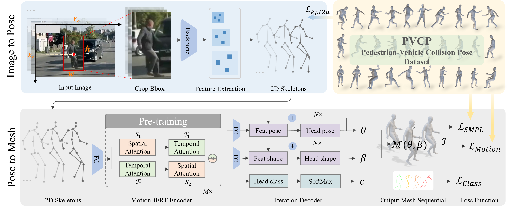
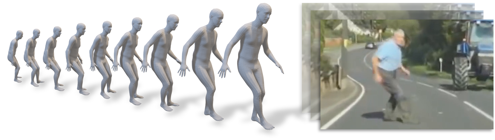
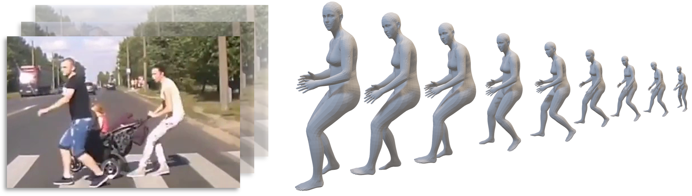

# 🤸‍♂️💥🚗 Pedestrian-Centric 3D Pre-collision Pose and Shape Estimation from Dashcam Perspective


## Dependencies


```commandline
conda create -n PVCP_env python=3.7
conda activate PVCP_env

# Please install PyTorch according to your CUDA version.
pip install torch==1.11.0+cu113 torchvision==0.12.0+cu113 torchaudio==0.11.0 --extra-index-url https://download.pytorch.org/whl/cu113
pip install -r requirements.txt
```
Some of our code and dependencies was adapted from [MotionBERT](https://github.com/Walter0807/MotionBERT). 


## 🔗 PVCP Dataset

We have provided a special Tool for SMPL annotation: [SMPL_Tools](https://github.com/wmj142326/SMPL_Tools).

Download the [PVCP Dataset (≈43G)](https://pan.baidu.com/s/1lNr5ak7_HtSy1CHQ3J20Gw?pwd=PVCP).
Directory structure: 

```commandline
PVCP
├── annotation
│   ├── dataset_2dpose.json
│   ├── dataset_mesh (coming soon).json
│   ├── mb_input_det_pose.json
│   ├── train_test_seq_id_list.json
│   ├── mesh_det_pvcp_train_release (coming soon).pkl
│   └── mesh_det_pvcp_train_gt2d_test_det2d (coming soon).pkl
├── frame
│   └── image2frame.py
├── image
│   ├── S000_1280x720_F000000_T000000.png
│   ├── S000_1280x720_F000001_T000001.png
│   ├── S000_1280x720_F000002_T000002.png
│   ├── ...
│   └── S208_1584x660_F000207_T042510.png
├── video
│   ├── S000_1280x720.mp4
│   ├── S001_1280x720.mp4
│   ├── S002_1280x720.mp4
│   ├── ...
│   └── S208_1584x660.mp4
└── vis_2dkpt_ann.mp4
```
For the `frame` folder, run `image2frame.py`. The folder structure is as follows:
```shell script

├── frame
   ├── frame_000000.png
   ├── frame_000001.png
   ├── frame_000002.png
   ├── ...
   └── frame_042510.png
```

### 🚩 Stay Tuned For:

- [ ] `We are working on more refined gesture labeling.`
- [ ] `We will add more types of annotation information.`
- [ ] `... `


## 🕸️ PPSENet Framework


### Project Directory Structure
```commandline
PVCP
├── checkpoint
├── configs
│   ├── mesh
│   └── pretrain
├── data
│   ├── mesh
│   └── pvcp
├── lib
│   ├── data
│   ├── model
│   └── utils
├── params
├── tools
├── LICENSE
├── README_MotionBERT.md
├── requirements.txt
├── train_mesh_pvcp.py
└── infer_wild_mesh_list.py

```


### Data
1. Download the other datasets [here](https://1drv.ms/f/s!AvAdh0LSjEOlfy-hqlHxdVMZxWM) and put them to  `data/mesh/`. We use Human3.6M, COCO, and PW3D for training and testing. Descriptions of the joint regressors could be found in [SPIN](https://github.com/nkolot/SPIN/tree/master/data).
2. Download the SMPL model(`basicModel_neutral_lbs_10_207_0_v1.0.0.pkl`) from [SMPLify](https://smplify.is.tue.mpg.de/), put it  to `data/mesh/`, and rename it as `SMPL_NEUTRAL.pkl`
3. Download the `PVCP dataset` and put them to  `data/pvcp/`. mv `mesh_det_pvcp_train_release.pkl` and `mesh_det_pvcp_train_gt2d_test_det2d.pkl` to `data/mesh/`.
    
* You can also skip the above steps and download our [data (include PVCP Dataset)](https://pan.baidu.com/s/1ysA3koyoMfAXnsM2KKvI_Q?pwd=2024) and [checkpoint](https://pan.baidu.com/s/1XthmAOLRvI2MCLop53I-VQ?pwd=h0aa) folders directly. Final, `data` directory structure as follows:
    ```commandline
    ├── data
        ├── mesh
        │   ├── J_regressor_extra.npy
        │   ├── J_regressor_h36m_correct.npy
        │   ├── mesh_det_coco.pkl
        │   ├── mesh_det_h36m.pkl
        │   ├── mesh_det_pvcp_train_gt2d_test_det2d.pkl
        │   ├── mesh_det_pvcp_train_release.pkl
        │   ├── mesh_det_pw3d.pkl
        │   ├── mesh_hybrik.zip
        │   ├── smpl_mean_params.npz
        │   └── SMPL_NEUTRAL.pkl
        └── pvcp
            ├── annotation
            │   ├── dataset_2dpose.json
            │   ├── dataset_mesh (coming soon).json
            │   ├── mb_input_det_pose.json
            │   ├── train_test_seq_id_list.json
            │   ├── mesh_det_pvcp_train_release (coming soon).pkl
            │   └── mesh_det_pvcp_train_gt2d_test_det2d (coming soon).pkl
            ├── frame
            ├── image
            └── video
    ```

### Train: 
Finetune from a pretrained model with PVCP
```shell script
CUDA_VISIBLE_DEVICES=0,1,2,3 python train_mesh_pvcp.py \
--config configs/mesh/MB_ft_pvcp.yaml \
--pretrained checkpoint/pretrain/MB_release \
--checkpoint checkpoint/mesh/ft_pvcp_iter3_class0.1_gt_release
```

### Evaluate
```shell script
CUDA_VISIBLE_DEVICES=0,1,2,3 python train_mesh_pvcp.py \
--config configs/mesh/MB_ft_pvcp.yaml \
--evaluate checkpoint/mesh/ft_pvcp_iter3_class0.1_gt_release/best_epoch.bin 
```

### Test and Demo
```shell script
python infer_wild_mesh_list.py --out_path output/
```


### 👀 Visual

<table>
  <tr>
    <td></td>
    <td></td>
  </tr>
  <tr>
    <td></td>
    <td></td>
  </tr>
  <tr>
    <td></td>
    <td></td>
  </tr>
  <tr>
    <td></td>
    <td></td>
  </tr>
</table>


### Citation
   ```
@inproceedings{wangpedestrian,
  title={Pedestrian-Centric 3D Pre-collision Pose and Shape Estimation from Dashcam Perspective},
  author={Wang, MeiJun and Meng, Yu and Qiu, Zhongwei and Zheng, Chao and Xu, Yan and Gao, Jian and others},
  booktitle={The Thirty-eighth Annual Conference on Neural Information Processing Systems}
}
   ```