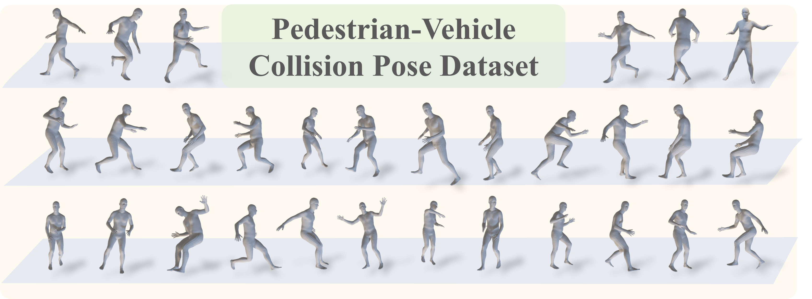

# PVCP
Pedestrian-Centric 3D Pre-collision Pose and Shape Estimation from Dashcam Perspective

## Dependencies

Some of our code and dependencies was adapted from [MotionBERT](https://github.com/Walter0807/MotionBERT).

## PVCP Dataset

We have provided a special Tool for SMPL annotation: [SMPL_Tools](https://github.com/wmj142326/SMPL_Tools)

Download the PVCP Dataset: [PVCP_Dataset](https://github.com/)

## PPSENet Framework

## Model Zoo

## Training

## Testing

## Demo

## Visual

<table>
  <tr>
    <td></td>
    <td></td>
  </tr>
  <tr>
    <td></td>
    <td></td>
  </tr>
  <tr>
    <td></td>
    <td></td>
  </tr>
  <tr>
    <td></td>
    <td></td>
  </tr>
</table>

This readme file is going to be further updated.